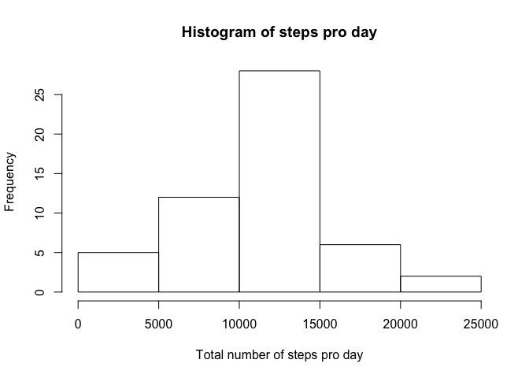
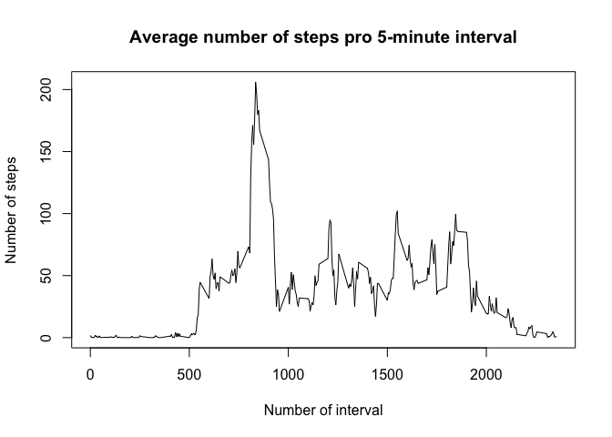
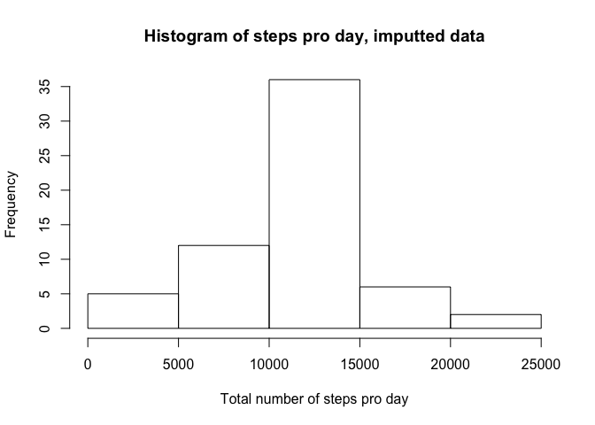
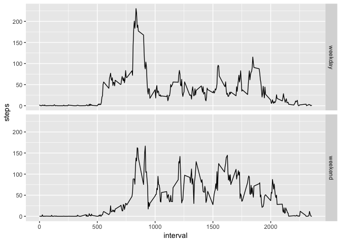

## Loading and preprocessing the data

First, the data is being read from zip file to the *act* data frame: 


```r
act<-read.csv(unz("activity.zip", "activity.csv"))
```
The structure of the dataset is


```r
str(act)
```

```
## 'data.frame':	17568 obs. of  3 variables:
##  $ steps   : int  NA NA NA NA NA NA NA NA NA NA ...
##  $ date    : Factor w/ 61 levels "2012-10-01","2012-10-02",..: 1 1 1 1 1 1 1 1 1 1 ...
##  $ interval: int  0 5 10 15 20 25 30 35 40 45 ...
```

For making the mean/median calculations and data imputting easier,
we convert *steps* variable from integer to numeric class:


```r
act$steps<-as.numeric(as.character(act$steps))
str(act)
```

```
## 'data.frame':	17568 obs. of  3 variables:
##  $ steps   : num  NA NA NA NA NA NA NA NA NA NA ...
##  $ date    : Factor w/ 61 levels "2012-10-01","2012-10-02",..: 1 1 1 1 1 1 1 1 1 1 ...
##  $ interval: int  0 5 10 15 20 25 30 35 40 45 ...
```


Further processing/transformation of the data at this step is not necessary,  the format is already suitable for analysis.

## What is mean total number of steps taken per day?

For this part of the assignment, the missing values in the dataset are ignored.

Calculation of the total number of steps taken per day:


```r
StepsProDay<-aggregate(act$steps, by=list(date=act$date), FUN=sum) 
```
    
The histogram of the total number of steps taken each day:


```r
hist(StepsProDay$x, xlab="Total number of steps pro day", main="Histogram of steps pro day") 
```

<!-- -->

The summary of *StepsProDay\$x* variable, describing the total number of steps taken each day,
is shown below:

```r
summ<-summary(StepsProDay$x)
summ
```

```
##    Min. 1st Qu.  Median    Mean 3rd Qu.    Max.    NA's 
##      41    8841   10765   10766   13294   21194       8
```

The mean of the total number of steps taken per day is **1.0766189\times 10^{4}** and median is **1.0765\times 10^{4}**.

## What is the average daily activity pattern?

The average number of steps taken pro 5-minute interval, averaged across all days is calculated the following way:


```r
StepsProInt<-aggregate(act$steps, by=list(interval=act$interval), FUN=mean, na.rm=T) 
```

The time series plot, showing the average number of steps taken during the 5-minute interval, averaged across all days:


```r
plot(StepsProInt$interval, StepsProInt$x, type="l", xlab="Number of interval", ylab="Number of steps", main="Average number of steps pro 5-minute interval") 
```

<!-- -->

The 5-minute interval number **835** contains the maximal number of steps, on average across all the days in the dataset.

## Imputing missing values

Note that there are a number of days/intervals where there are missing values (coded as NA). The presence of missing days may introduce bias into some calculations or summaries of the data.

The total number of missing values in the dataset is calculated the following way:

```r
nrow(act[!complete.cases(act),])
```

```
## [1] 2304
```

and it is equal to **2304**.

The missing values in the dataset will be filled with the mean values over all days for the corresponding 5-minute interval, resulting to the new data set *act2*:


```r
act2<-act
listBadRows<-which(!complete.cases(act))
invisible(lapply(listBadRows, function (y) act2[y,]$steps<<-StepsProInt[StepsProInt$interval==act2[y,]$interval,]$x))
```

The histogram of the total number of steps taken each day with imputted data:


```r
StepsProDay2<-aggregate(act2$steps, by=list(date=act2$date), FUN=sum) 
hist(StepsProDay2$x, xlab="Total number of steps pro day", main="Histogram of steps pro day, imputted data") 
```

<!-- -->

The summary of *StepsProDay2\$x* variable, describing the total number of steps taken each day 
with imputted data, is shown below:

```r
summ2<-summary(StepsProDay2$x)
summ2
```

```
##    Min. 1st Qu.  Median    Mean 3rd Qu.    Max. 
##      41    9819   10766   10766   12811   21194
```

The mean of the total number of steps taken per day is **1.0766189\times 10^{4}** and median is **1.0766189\times 10^{4}**.

The mean of the imputted data did not changed, and the median differs negligibly from the estimates from the first part of the assignment. The way of imputting data have been chosen to not affect mean of the data.

The total daily number of steps increased by number of steps imputted to the NA entries of initial data set.

## Are there differences in activity patterns between weekdays and weekends?

For this part the dataset with the filled-in missing values *act2* is used.

A new factor variable *wday* in the dataset with two levels – “weekday” and “weekend” indicating whether a given date is a weekday or weekend day is created:


```r
CheckWeekDay<-function (x) {
  if (weekdays(as.Date(x)) %in% c("Saturday","Sunday"))
    return("weekend")
  else
    return("weekday")
}

act2$wday<-as.factor(unlist(lapply(act2$date, CheckWeekDay)))
```

The panel plot, containing a time series of the 5-minute interval and the average number of steps taken, averaged across all weekday days or weekend days:


```r
ggplot(act2, aes(interval, steps)) + facet_grid(wday ~ .) + stat_summary(fun.y = mean, geom = "line")
```

<!-- -->

